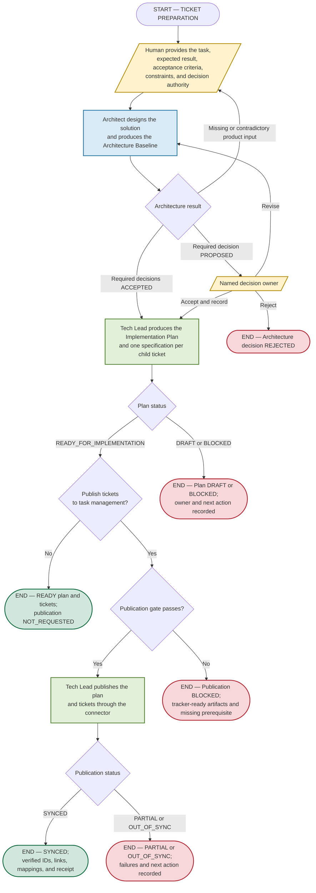
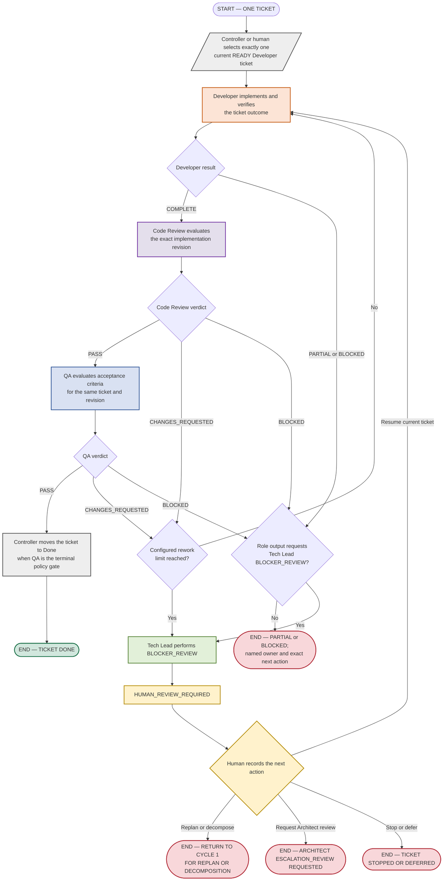

# Development Lifecycle — Split Cycles

Review status: PROPOSED

This document deliberately separates ticket preparation from delivery of one
ticket. Each cycle has its own start condition, explicit role outputs, actions,
decisions, and terminal states.

These diagrams describe the standard and consequential delivery paths. They are
not mandatory for bounded research or every low-risk ticket. Select the
proportional route first in [Execution Profiles](execution-profiles.md); then use
the applicable cycle below without weakening its role gates.

Semantic states such as READY, COMPLETE, and PASS are not tracker workflow
columns. Roles produce verdicts, reports, comments, and requested actions. A
future deterministic Lifecycle Controller or a human workflow owner performs
authorized tracker transitions.

## Cycle 1 — Prepare and publish implementation tickets

Purpose: convert a human task definition into accepted architecture, a validated
Implementation Plan, independently usable child-ticket specifications, and—when
requested and authorized—verified records in the task-management system.

### Cycle 1 outputs

| Producer | Explicit output | Consumer or action |
| --- | --- | --- |
| Human | Task description, expected result, acceptance criteria, constraints, authority | Architect DESIGN |
| Architect | Architecture baseline, ADRs, workstreams, risks, migration, verification evidence, exact next action | Human decision owner or Tech Lead PLAN |
| Tech Lead | Implementation Plan and one independently usable Implementation Task per child ticket | Connector, Lifecycle Controller, or Developer session |
| Tracker connector | Verified external IDs, links, hierarchy, dependencies, mappings, and publication receipt | Lifecycle Controller |
| Cycle terminal | Plan DRAFT/BLOCKED, architecture decision REJECTED, READY tickets with NOT_REQUESTED or SYNCED publication, or publication PARTIAL/OUT_OF_SYNC/BLOCKED | Cycle 2, decision owner, or named recovery owner |

## Cycle 2 — Deliver one ticket

Purpose: move exactly one current READY ticket through Developer, Code Review,
and QA. The normal successful terminal state is Done. Replanning and architecture
work leave this cycle and return to Cycle 1 instead of being mixed into it.

The diagram shows the default path. A Code Review waiver may skip Code Review
only when it is explicitly authorized and bound to the current ticket revision
as required by the Developer and QA contracts.

### Cycle 2 outputs

| Producer | Explicit output | Controller or human action |
| --- | --- | --- |
| Developer | Code, tests, affected docs, exact revision, implementation report, mandatory ticket comment, COMPLETE/PARTIAL/BLOCKED | Route COMPLETE to Code Review; for PARTIAL/BLOCKED follow the recorded next owner and action |
| Code Review | Findings, verification, exact target, mandatory ticket comment, PASS/CHANGES_REQUESTED/BLOCKED | PASS → QA; CHANGES_REQUESTED → rework counter and Developer; BLOCKED → named owner or Tech Lead |
| QA | Acceptance matrix, evidence, mandatory ticket comment, PASS/CHANGES_REQUESTED/BLOCKED | PASS → Done when policy permits; CHANGES_REQUESTED → rework counter and Developer; BLOCKED → named owner or Tech Lead |
| Tech Lead BLOCKER_REVIEW | Classification, evidence, retained work, proposal, alternatives, scope impact, recommended role, HUMAN_REVIEW_REQUIRED | Always present the package to a human; do not execute the recommendation |
| Human | Recorded decision to resume, replan or decompose, request Architect review, or stop or defer | Controller performs only the authorized next transition |
| Cycle terminal | Ticket Done, PARTIAL/BLOCKED with a named next owner, return to Cycle 1, Architect escalation request, or stopped/deferred ticket | Start the indicated separate cycle or end processing |

## Shared invariants

1. Human input is the first operation after the preparation START.
2. Cycle 1 ends before Cycle 2 starts. Cycle 2 receives exactly one current READY
   ticket; it does not reconstruct a plan or architecture scope.
3. Developer, Code Review, and QA each operate on exactly one ticket per
   invocation. Code Review and QA evaluate one exact implementation revision;
   Developer records the exact revision it produced.
4. The successful sequence is Developer COMPLETE → Code Review PASS → QA PASS.
5. The only permitted shortcut is an authorized Code Review waiver bound to the
   current ticket revision.
6. Every final Developer result and every Code Review or QA verdict requires a
   durable ticket-history comment before routing.
7. Developer, Code Review, and QA do not mutate tracker workflow state.
8. PARTIAL or BLOCKED work never enters a later gate as ready.
9. A rework count can trigger BLOCKER_REVIEW but cannot establish the cause.
10. Every BLOCKER_REVIEW ends in HUMAN_REVIEW_REQUIRED. The ticket remains paused
    until the human decision is recorded.

## Deliberately separate future cycle

Scope-level Tech Lead COMPLETENESS_REVIEW and Architect CONFORMANCE_REVIEW are not
embedded in either diagram. They should be documented as a third, independent
scope-completion cycle after the preparation and single-ticket cycles are
approved.
